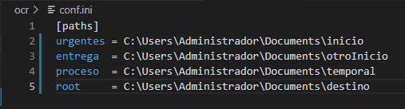

# OCR 

### Script  para añadir capa de ***OCR*** a documentos ***PDF*** y compresión de los mismos.

--- 

## *Requisitos*:

* Python 3.x 
* Librerias de Python necesarias:
    * img2pdf
    * ocrmypdf
    * PyPDF2


## *INSTALACIÓN*

1. Instalar ***[python](https://www.python.org/downloads/ "Click para descargar python desde el sitio oficial")*** asegurate de añadir ***[python](https://www.python.org/downloads/ "Click para descargar python desde el sitio oficial")***  al ***path*** al momento de la instalación e instalar ***pip***.

2. Clonar el repositorio
```  
    git clone https://github.com/1franky/pdfOCR.git
```  
3. Instalar las siguientes librerias, copia y pega los siguientes comandos en una terminal ***CMD***:

```  
    pip install img2pdf 
```  
```  
    pip install ocrmypdf
```  
```  
    pip install PyPDF2
```

4. Cortar y pegar la carpeta ***ocrCompresor*** en  ***C:\\***

## *Uso*
### configuracion del *conf.ini* 
* Abrir con su editor de texto favorito :wink:




