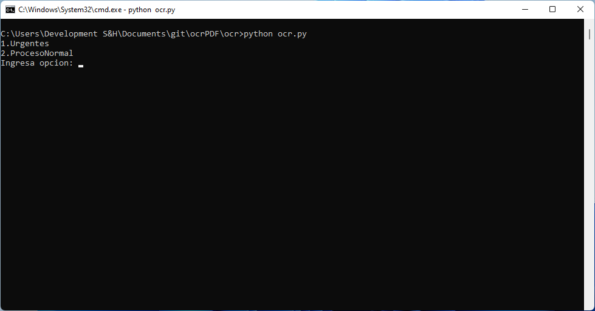

# OCR 

### Script  para añadir capa de ***OCR*** a documentos ***PDF*** y compresión de los mismos.

--- 

## *Requisitos*:

* Python 3.x 
* Librerias de Python necesarias:
    * img2pdf
    * ocrmypdf
    * PyPDF2


## *INSTALACIÓN*

1. Instalar ***[python](https://www.python.org/downloads/ "Click para descargar python desde el sitio oficial")*** asegurate de añadir ***[python](https://www.python.org/downloads/ "Click para descargar python desde el sitio oficial")***  al ***path*** al momento de la instalación e instalar ***pip***.
    

2. Clonar el repositorio
```  
    git clone https://github.com/1franky/pdfOCR.git
```  

3. Abrir una ventana de ***powershell*** como administrador y pegar lo siguiente:
``` 
    Set-ExecutionPolicy Bypass -Scope Process -Force; [System.Net.ServicePointManager]::SecurityProtocol = [System.Net.ServicePointManager]::SecurityProtocol -bor 3072; iex ((New-Object System.Net.WebClient).DownloadString('https://community.chocolatey.org/install.ps1'))
``` 
4. Abrir una consola ***CMD*** como administrador y pegar los siguiente comandos:
``` 
    choco install --pre tesseract -y
``` 
``` 
    choco install ghostscript -y 
``` 
``` 
    choco install pngquant -y
``` 

5. Instalar las siguientes librerias, copia y pega los siguientes comandos en una terminal ***CMD***:

```  
    pip install img2pdf 
```  
```  
    pip install ocrmypdf
```  
```  
    pip install PyPDF2
```

5. Cortar y pegar la carpeta ***ocrCompresor*** en  ***C:\\***

## *Configuración y uso*
### configuracion del *conf.ini* 
* Abrir con su editor de texto favorito :wink:

    

    Sustituimos por la ruta a nuestros directorios sobre los que queremos trabajar.

    *urgentes* y *entrega* pueden apuntar hacia el mismo directorio, mientras proceso debe apuntar a otro directorio disntinto fuera de la raiz de los directorios de *urgentes* y *entrega* con el fin de evitar errores ya que el proceso es recursico. *root* debe apuntar a el directorio final donde se depositaran los archivos al final del proceso de ***OCR*** y ***compresión***.

### Si llegaste hasta aqui sin ningún incoveniente ya solo queda disfrutar :blush:

* Ejecuta el script dandole doble click pero es mas recomendable hacerlo desde una ventana de comandos para poder visualizar algún error en dado caso que lo hubiera. 
Navega hasta el directorio y ejecuta ***python ocr.py***

    

    Solo deberas eligir la opcion de acuerdo a tus necesidades la opcion 1 hace referencia al primer directorio que configuraste cuando editaste el archivo **conf.ini** mientras la segunda opción apunta hacia el segundo directorio.

#### Ya solo queda esperar a que termine el proceso  :yum:


##### A veces el scrip llega a fallar y pero descuida tus archivos estan seguros 
Solo debes navegar al tercer directorio que configuraste el paso de edición del **conf.ini** y regresar los archivos a a su directorio inicial.

:smile:


